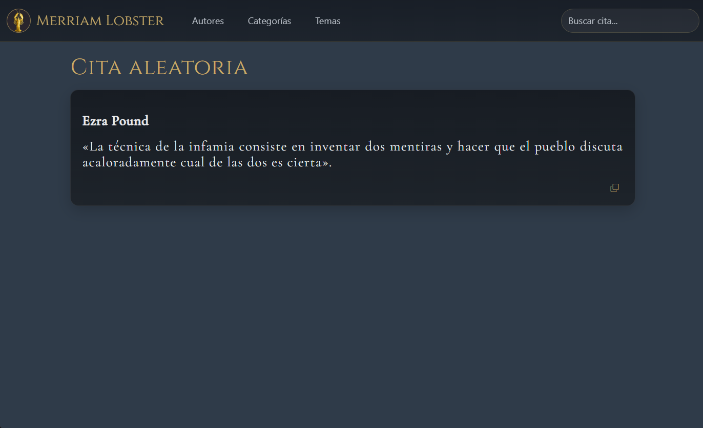

# Quotes

Toolkit y *webapp* en Python para gestionar, consultar y mantener una colección de citas en `quotes.json`.



Se puede ejecutar en Windows y Termux.

---

## 📦 Componentes

### `getquote.py`

Muestra citas en consola con filtros.

### `merge_quotes.py`

Incorpora citas desde otros JSON con deduplicación y backup.

### `review_quotes.py`

Analiza calidad, consistencia y posibles problemas del repositorio.

### `quotes.json`

Base de datos de citas.

---

## 📐 Formato de `quotes.json`

Cada entrada sigue esta estructura:

```json
{
  "author": "Nombre",
  "quote": "Texto",
  "ref": "Fuente (opcional)",
  "category": "Filosofía",
  "theme": "pensamiento",
  "source_quality": "high"
}
```

### Campos

- `author` (obligatorio)
- `quote` (obligatorio)
- `ref` (opcional pero recomendado)
- `category` (obligatorio)
- `theme` (obligatorio, puede ser `""`)
- `source_quality` (`low`, `medium`, `high`)

---

## 🚀 Uso

### Mostrar citas

```bash
python getquote.py
python getquote.py --author="Nietzsche"
python getquote.py --theme=ética
python getquote.py --category=Ingeniería
python getquote.py --hardcore
python getquote.py --all
python getquote.py --paged
```

### Listados

```bash
python getquote.py --list_authors
python getquote.py --list_categories
python getquote.py --list_themes
```

---

## 🔄 Incorporar nuevas citas

```bash
python merge_quotes.py nuevas.json
```

Ejemplo real:

```bash
python merge_quotes.py unamuno.json --target quotes.json
```

Salida típica:

```text
Inicial:  444
Nuevas:   1
Añadidas: 1
Final:    445
Backup:   quotes.json.bak.20260414-003904
```

### Opciones

```bash
--dry-run        # no escribe cambios
--replace        # reemplaza duplicados
--sort           # ordena resultado
--strict-theme   # exige clave theme
--no-backup      # desactiva backup
```

---

## 🔍 Revisión de calidad

```bash
python review_quotes.py
```

Generar informe:

```bash
python review_quotes.py --report review.md
```

Detecta:

- citas sin `ref`
- themes inválidos o vacíos
- duplicados exactos
- duplicados semánticos
- distribución por calidad
- autores con citas de baja calidad

---

## 🧠 Filosofía

Este proyecto prioriza:

- fiabilidad sobre viralidad
- texto original sobre versiones simplificadas
- consistencia estructural
- simplicidad operativa

---

## ⚠️ Notas

- Muchas citas populares están mal atribuidas o deformadas
- Preferir siempre fuentes primarias cuando sea posible
- Mantener el conjunto de `theme` controlado y evitar microtemas innecesarios

---

## 🔄 Flujo recomendado

1. Preparar citas en JSON
2. Incorporar:

```bash
python merge_quotes.py nuevas.json
```

3. Revisar:

```bash
python review_quotes.py
```

4. Corregir lo dudoso

---

## 📈 Estado actual

- ~445 citas
- taxonomía de themes unificada
- deduplicación automática
- sistema de revisión incorporado

---

## 🧩 Futuras mejoras

- lint automático antes de commit
- detección avanzada de duplicados
- enriquecimiento de metadatos (`source_type`, notas, etc.)

---

Fin.
