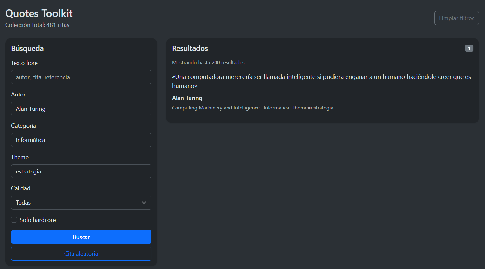

# Quotes WebApp

{50%}

Primera versión funcional de interfaz web para `quotes.json` usando FastAPI + Jinja2 + Bootstrap.

## Archivos

- `app.py`: aplicación FastAPI
- `quoteslib.py`: lógica compartida de carga y filtrado
- `templates/index.html`: interfaz Bootstrap
- `static/custom.css`: estilos mínimos
- `requirements.txt`: dependencias

## Requisitos

```bash
pip install -r requirements.txt
```

## Arranque

Desde la carpeta del proyecto:

```bash
uvicorn app:app --reload
```

Luego abre `http://127.0.0.1:8000`

## Usar otro `quotes.json`

Por defecto busca `quotes.json` en la misma carpeta que `app.py`.

### Linux / Termux

```bash
QUOTES_FILE=/ruta/a/quotes.json uvicorn app:app --reload
```

### Windows PowerShell

```powershell
$env:QUOTES_FILE="C:\ruta\a\quotes.json"
uvicorn app:app --reload
```

## Qué incluye esta versión

- búsqueda por texto libre
- filtros por autor, categoría, theme, quality y hardcore
- botón de cita aleatoria
- sugerencias con `datalist`
- soporte para categoría paraguas `Ingeniería`
- endpoint `/health`
